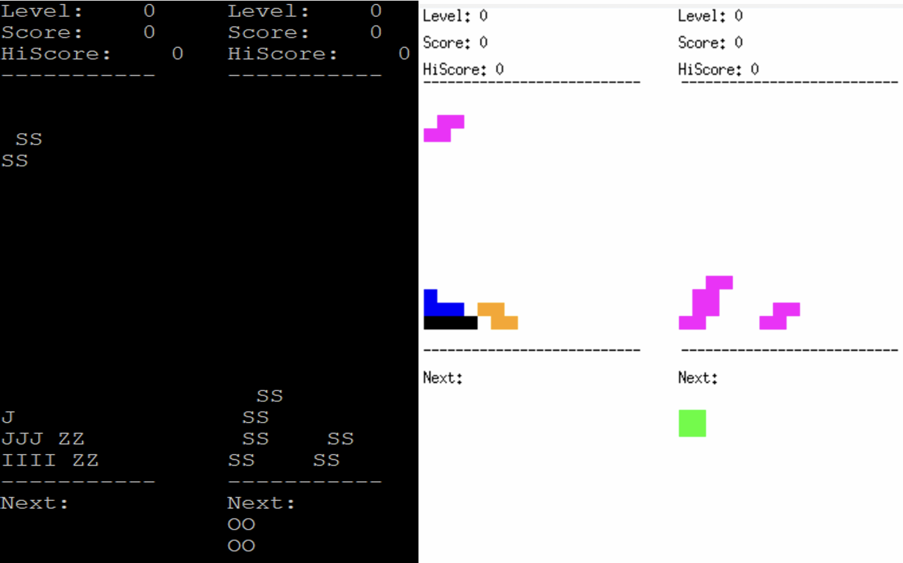
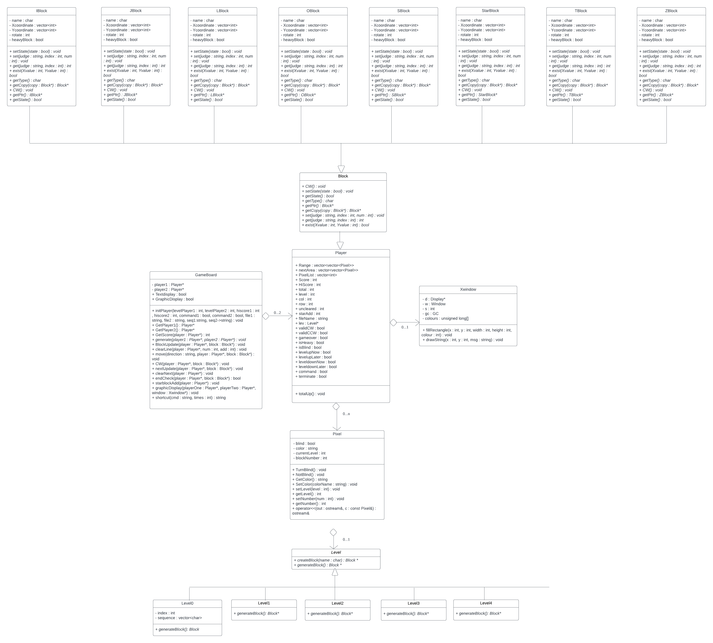

# Biquadris


Biquadris is a strategic two-player block placement game implemented in C++ with both text-based and graphical interfaces. The game includes multiple levels of complexity and allows players to use special actions to influence their opponent’s gameplay. This project demonstrates the power of object-oriented programming principles, modular design, and the use of the MVC (Model-View-Controller) pattern.

---

## Table of Contents
- [Introduction](#introduction)
- [Features](#features)
- [Game Design](#game-design)
- [Installation](#installation)
- [Running the Game Locally](#running-the-game-locally)
- [License](#license)

---

## Introduction

Biquadris was developed as part of a software design project in CS 246 (Spring 2023) to demonstrate advanced programming concepts in game design. It is inspired by popular block games and offers a unique two-player experience, where each player competes to clear rows and accumulate scores, while having opportunities to disrupt each other's progress.

## Features

- **Multi-level Gameplay:** Five levels with increasing difficulty.
- **Special Actions:** Players can use special actions to affect their opponent's gameplay (e.g., adding "heavy blocks").
- **Text and Graphical Interfaces:** Supports both command-line and GUI versions.
- **Customizable Commands:** Shortcut commands for movement and rotation.
- **Keyboard Support:** Supports keyboard arrow keys and other keyboard shortcuts for gameplay.

## Game Design

The game follows an MVC (Model-View-Controller) pattern for separation of concerns:
- **Model**: Contains core game logic, including block generation, movement, and scoring.
- **View**: Manages both text-based and graphical displays, allowing flexibility in presentation.
- **Controller**: Interprets player input and updates game state accordingly.

### UML Diagram


### Key Classes

- **Gameboard**: Manages board state and player actions.
- **Player**: Holds player-specific data, such as score and level.
- **Block**: Abstract class with subclasses like IBlock, JBlock, etc., representing different types of blocks.
- **Level**: Uses a Factory design pattern to generate blocks based on the current level.

### Resilience to Change

The game's architecture allows easy addition of new levels, commands, and effects without major refactoring, due to the use of Factory patterns and modular class design.

## Installation

### Downloading and Setting Up Locally

1. **Clone this repository** to your local machine by running:
   ```bash
   git clone https://github.com/Cara-jr/biquadris.git
   ```
2. **Navigate to the project directory**:
   ```bash
   cd biquadris
   ```
3. **Compile the program**:
   Make sure you have a C++ compiler installed (like `g++`), and then compile using `make`:
   ```bash
   make
   ```

   This will build the executable file that you can use to run the game locally.

## Running the Game Locally

Once the game is compiled, you can start playing Biquadris on your local machine.

1. **Run the game**:
   ```bash
   ./biquadris
   ```
2. **Game Controls**:
   Use keyboard controls or text-based commands for gameplay:
   - **Arrow Keys**: Move blocks left, right, or down.
   - **a, s, d, q, e**: Represent left, down, right, counterclockwise, and clockwise rotations, respectively.
   - **Drop (dd)**: Immediately drops the block.

3. **Exit the Game**:
   You can exit the game at any time by closing the window or using a command to quit.


## License

This project is inspired by [University of Waterloo](https://uwaterloo.ca/), with copyright belonging to the original authors.

---

With these instructions, you can easily download, set up, and enjoy playing Biquadris locally on your own computer!
```

This README now provides clear instructions for cloning, setting up, and running the game locally. The demo section also includes a placeholder for the video link so users can see a preview of the game in action.
